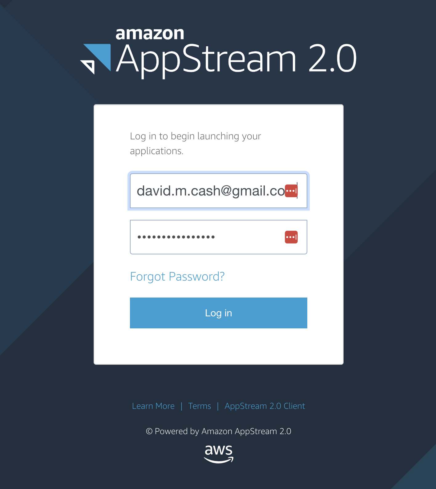

## Connecting to your virtual machine

This page will tell you how to access your personal virtual (VM) to run these 
lessons. The virtual machine is essentially a "computer within a computer". 
For this workshop, we have created virtual machines that have all the 
necessary software to perform the lessons. Here are the requirements for AWS 
AppStream2.0 from the manufacturer’s website: Users can access AppStream 2.0 
through an HTML5-capable web browser on a desktop computer such as a Windows, 
Mac, Chromebook, or Linux computer. HTML5-capable web browsers that can be 
used include the following: Google Chrome, Safari, Microsoft Edge. NOTE: We 
would recommend not using Mozilla Firefox, particularly on Mac OS X, as we 
have noticed some issues with it at previous workshops.

### Cloud based instructions
If you have completed the pre-survey questionnaire, then you should have received two emails. 
These may be located in your spam email:

1. One should be from the email address no-reply@accounts.eu-west-2.amazonappstream.com 
with the title _Start accessing your apps using Amazon AppStream 2.0_. This will
have the link to set your password and log in for the first time. 
1. A second email should come from the same email with the title
_Amazon AppStream 2.0: New apps available_. 
 {alt="Appstream Email"}
1. Click on the login link, and you should see the following page.
 {alt="Appstream Login" height="400px"}
1. Click on the **Desktop** item. It will then launch a computer and you will be able to see the Desktop on the screen
 {alt="Appstream Choose Desktop" height="400px"}
1. You will see a status message that it is starting your machine. After that you should see a desktop of the computer you will be doing the lesson with.
 {alt="Appstream Desktop"}
1. **If you get an error message** saying "Resources not available, please wait a few minutes, as there will be more virtual machines spinning up to match the demand.
1. Look out for a message from your web browser asking you to allow the web 
page to access the clipboard. Please make sure to allow this, as it will be
easier to cut and paste from these lessons into the VM.

**If you did not supply an email yet, please approach an instructor and we will setup your account**

### Organizing Committee
The following committee members have been developing and testing the content and will be on-hand to lead the sessions and assist individuals. 

| Name | Organization |
| --- | --- |
| David Cash | UCL Queen Square Institute of Neurology, United Kingdom |
| Luigi Lorenzini | Amsterdam UMC, Netherlands |
| Ludovica Griffanti | University of Oxford, United Kingdom |
| Tobey Betthauser | University of Wisconsin, U.S.A. | 
| Alexa Pichet Binette | Lund University, Sweden |

### Acknowledgements
These lessons are developed as part of the [Health and Biosciences IDEAS](https://healthbioscienceideas.github.io) project, which is a training initiative funded by [UKRI Innovation Scholars](https://www.ukri.org/opportunity/innovation-scholars-data-science-training-in-health-bioscience/) (MR/V03863X/1)

Thanks to the generous support of the Alzheimer's Association, the [International Society to Advance Alzheimer's Research and Treatment (ISTAART)](https://action.alz.org/personifyebusiness/default.aspx?tabid=1516) and the ISTAART Neuroimaging Professional Interest Area in terms of travel funding for the organizers.

The data for this course comes from the [Open Access Series of Imaging Studies](https://www.oasis-brains.org/)(OASIS) dataset. Many thanks to Pamela LaMontaigne and the OASIS team as Washington University for their support with the data.

Special thanks to Christian Haselgrove (NITRC-CE), Courtney Waugh (Amazon), and Mark Watts (UCL) for their support in creating the infrastructure for this project. 
