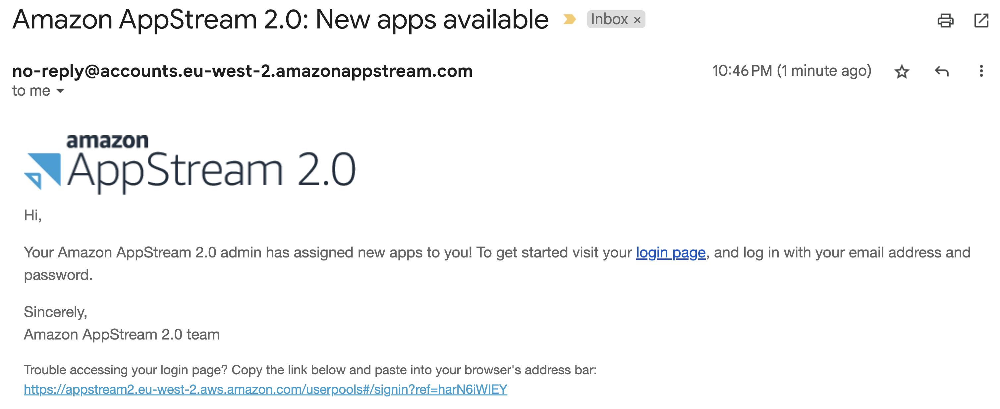
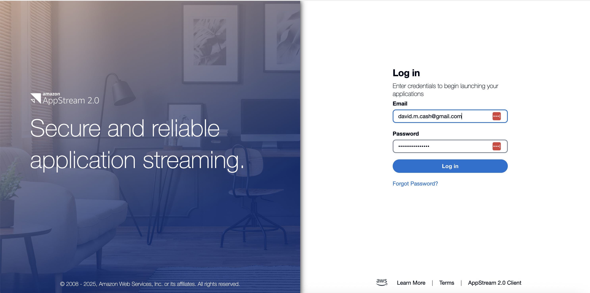
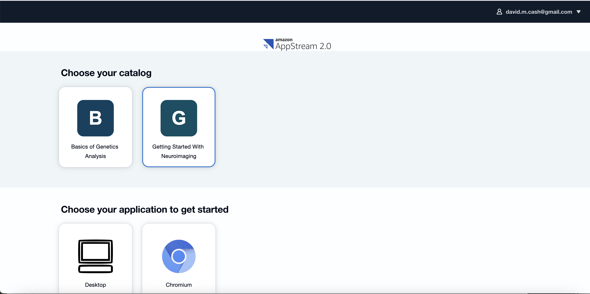
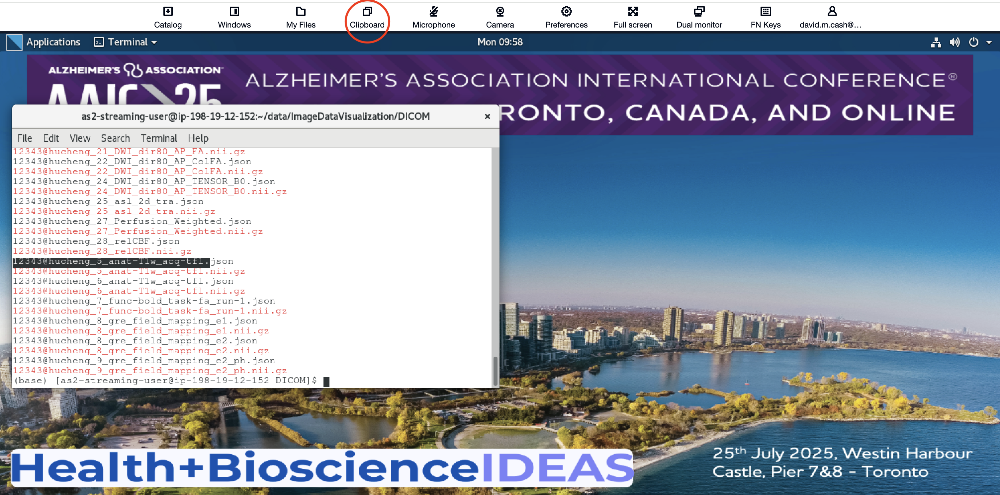
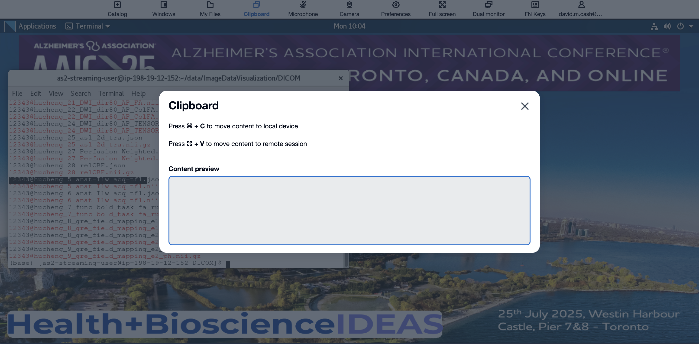
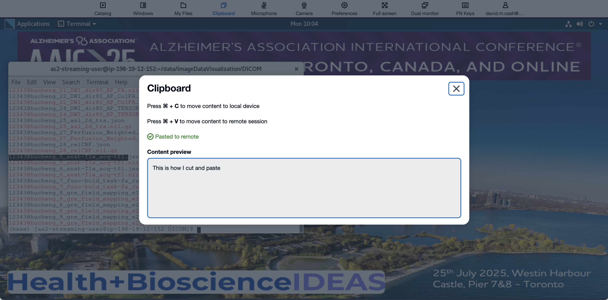
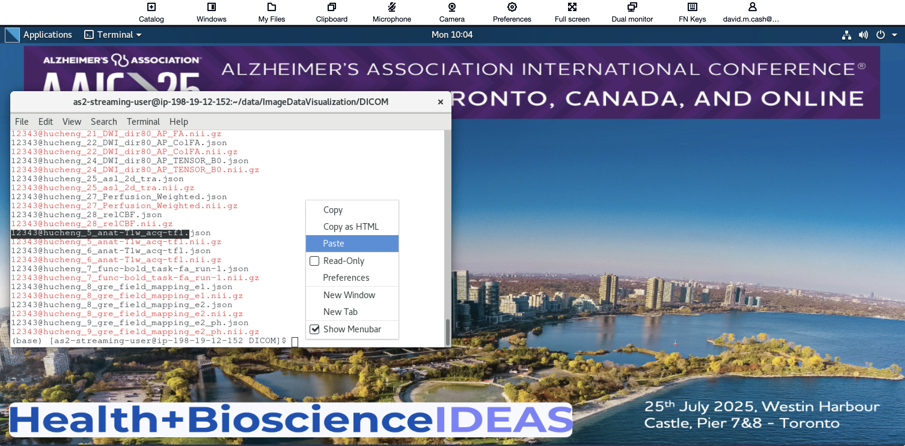

## Connecting to your virtual machine

This page will tell you how to access your personal virtual (VM) to run these 
lessons. The virtual machine is essentially a "computer within a computer". 
For this workshop, we have created virtual machines that have all the 
necessary software to perform the lessons. Here are the requirements for AWS 
WorkSpaces from the manufacturer’s website: Users can access WorkSpaces 
through an HTML5-capable web browser on a desktop computer such as a Windows, 
Mac, Chromebook, or Linux computer. HTML5-capable web browsers that can be 
used include the following: Google Chrome, Safari, Microsoft Edge. 

::::::::::::::: caution
We would recommend not using Mozilla Firefox, particularly on Mac OS X, as we 
have noticed some issues with it at previous workshops.
:::::::::::::::

### Logging into the cloud
**If you did not supply an email yet, please approach an instructor and we will setup your account**

If you have completed the pre-survey questionnaire, then you should have received two emails. 
These may be located in your spam email:

1. One should be from the email address no-reply@accounts.us-east-2.amazonappstream.com 
with the title _Start accessing your apps using Amazon AppStream 2.0_. This will
have the link to set your password and log in for the first time. 
1. A second email should come from the same email with the title
_Amazon AppStream 2.0: New apps available_. 
 {alt="Appstream Email"}
1. Click on the login link, and you should see the following page.
 {alt="Appstream Login" }
1. Click on the **Desktop** item. It will then launch a computer and you will be able to see the Desktop on the screen
 {alt="Appstream Choose Desktop"}
1. You will see a status message that it is starting your machine. After that you should see a desktop of the computer you will be doing the lesson with.
 {alt="Appstream Desktop"}
1. **If you get an error message** saying "Resources not available, please wait a few minutes, as there will be more virtual machines spinning up to match the demand.

::::::::::::::::::: discussion
### Copying commands to the VM
Our goal for this workshop is for you to type as many of the commands as
possible, as we don't find attendees absorb the information as much if you are
only repeatedly cutting and pasting commands into the terminal, or if tou are 
just clicking on cells to run commands. At the same time, it is useful to have
the ability to copy commands from these lessons and then paste them
into the VM.

Look out for a message from your web browser asking you to allow the web 
page to access the clipboard. Please make sure to allow this, as it will be
easier to cut and paste from these lessons into the VM.

Another option is to use the clipboard option on the top menu of the VM. 
Click on the clipboard option found above
{alt="Select Clipboard menu"}

This will open up a little dialog. 
{alt="Clipboard dialog box"}

Copy the text
`This is how I cut and paste` from this lesson, and then use the appropriate
shortcut (Cntl-V for PC or &#8984;-V for Mac) to put that in a terminal.
{alt="Clipboard dialog box with text pasted"}

This is now on the virtual machine's clipboard. You can past this in by 
right-clicking in a terminal window and selecting paste.
{alt="Right click mouse in terminal"}

And voila! You should see the paste in the virtual machine.
{alt="Text pasted into terminal"}

:::::::::::::::::::::::::
